## LAB MIGRATING VM TO AZURE
## By- Seerat Sawhney , 041107886

# VMware-to-Azure Migration Lab Report

## **Introduction**
This report documents the process of migrating two Windows Server 2022 VMs from VMware Workstation Pro to Azure. The migration was performed using Azure Migrate, enabling a seamless transition of the on-premises environment to the cloud. The lab emphasized core migration practices, including readiness assessment, migration execution, validation, and failover testing, with the successful deployment of a "Hello World" application in Azure.

---

## **1. Assessment Report**
### **Objective**
The objective of this phase was to assess the migration readiness of two VMs running on VMware Workstation Pro. Azure Migrate was used to evaluate compatibility, performance, and any potential issues that could impact the migration process.

### **Process**
1. **Setup Azure Migrate Appliance**:
   - The Azure Migrate appliance was installed on a dedicated VM (VM2) to discover and assess other servers.
   - The project key from Azure was used to register the appliance successfully after resolving connection issues.

2. **Discovery Configuration**:
   - Since the VMs were running on VMware Workstation Pro, they were treated as physical servers for assessment.
   - The IP addresses and admin credentials of both VMs were added for discovery.

3. **Assessment Run**:
   - Azure Migrate performed a detailed assessment, including disk configurations, resource utilization, and potential cost estimations in Azure.

### **Findings**
- **Readiness**:
  - VM1 and VM2 were deemed **ready for migration**, requiring no significant changes.
- **Performance Metrics**:
  - VM1: Moderate CPU utilization (45%) with memory usage peaking at 3GB.
  - VM2: Low resource utilization as it primarily hosted the Azure Migrate appliance.
- **Disk Configuration**:
  - Both VMs used dynamic virtual disks, which were supported in Azure.

### **Recommendations**
- Implement **auto-scaling** for VM1 after migration to optimize performance.
- Configure **backup policies** in Azure for both VMs to ensure data integrity.

### **Supporting Evidence**
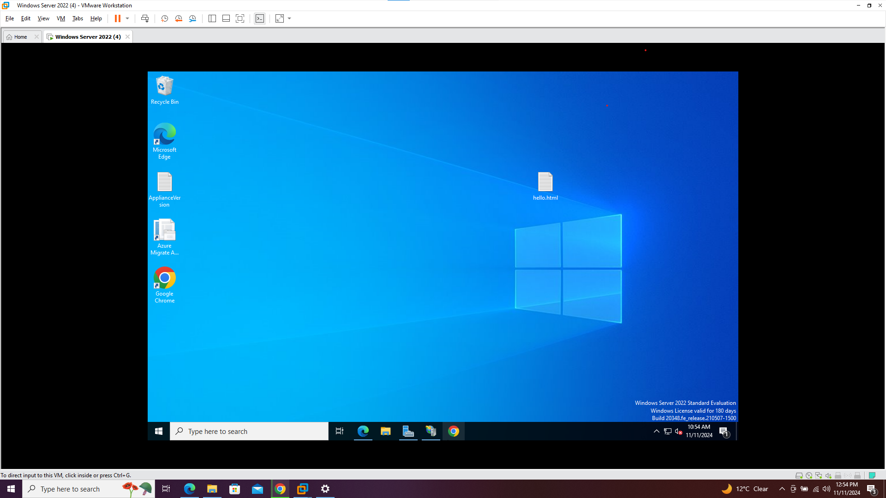

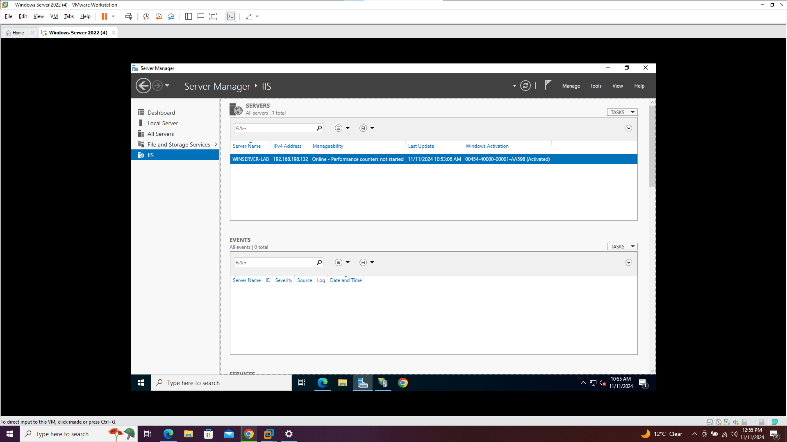

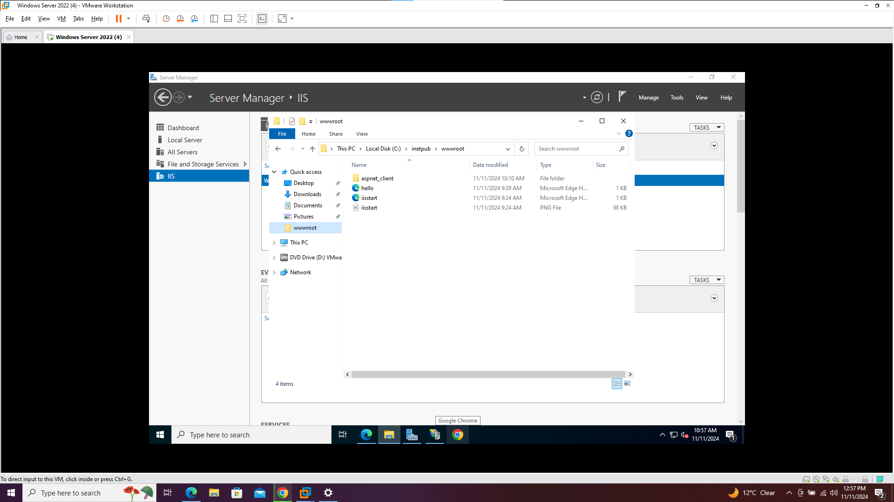

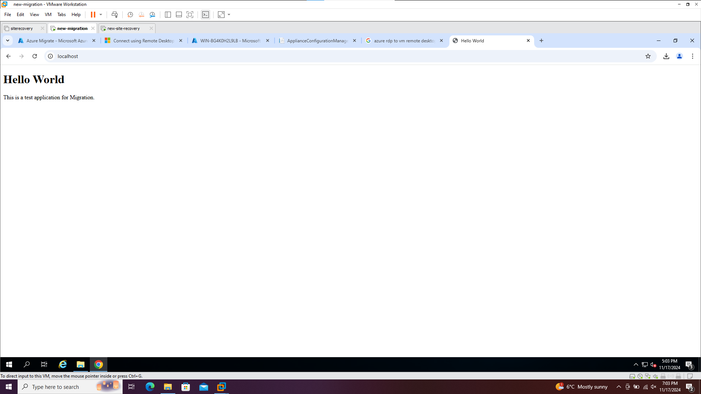

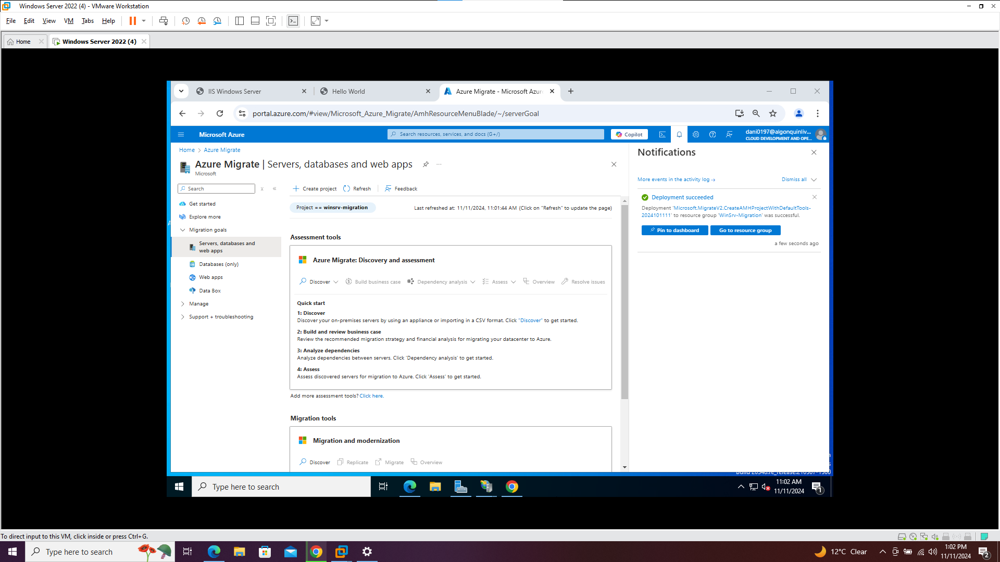

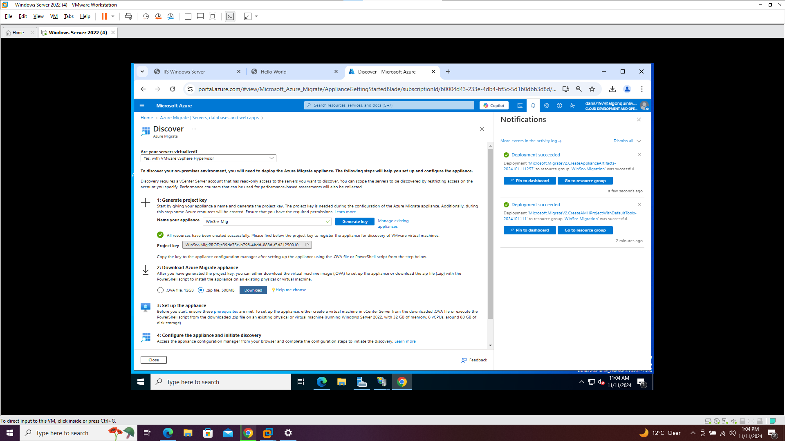

---

## **2. Migration Outcome**
### **Objective**
This phase focused on migrating the VMs to Azure while addressing any issues encountered during the process.

### **Migration Method**
The migration was performed using Azure Migrate's **lift-and-shift** approach, where the entire VM was moved to Azure without modifying its architecture.

### **Steps Taken**
1. **Register Azure Migrate Appliance**:
   - Used the project key from Azure to connect the appliance.
   - Verified appliance registration through the Azure portal.

2. **Migration Execution**:
   - Azure Migrate was used to replicate the VMs to Azure.
   - After the initial replication, a final sync was performed to ensure data consistency.

### **Issues Encountered and Resolutions**
1. **Azure Migrate Appliance not detecting VMs**:
   - **Issue**: The appliance failed to discover the VMs initially.
   - **Resolution**: Restarted the appliance and ensured proper network connectivity.

2. **SSL Certificate Error**:
   - **Issue**: Accessing the appliance’s web interface showed a "connection not private" error.
   - **Resolution**: Bypassed SSL errors using PowerShell and configured HTTPS manually.

3. **Credential Validation Failure**:
   - **Issue**: During discovery, Azure Migrate appliance failed to validate the provided admin credentials.
   - **Resolution**: Added outbound rules to the VM’s firewall to allow HTTPS (port 443) and other required protocols, ensuring connectivity with Azure.

4. **Discovery Challenges**:
   - **Issue**: Azure Migrate defaulted to "vCenter Server" as the source type.
   - **Resolution**: Selected "Physical Server" as the source and manually added VM IPs.

### **Outcome**
- Both VMs were successfully migrated to Azure, retaining their original configurations and functionality.
- Post-migration, the VMs were fully operational, with no data loss or performance degradation.

### **Supporting Evidence**

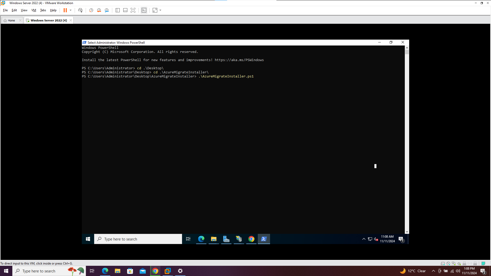

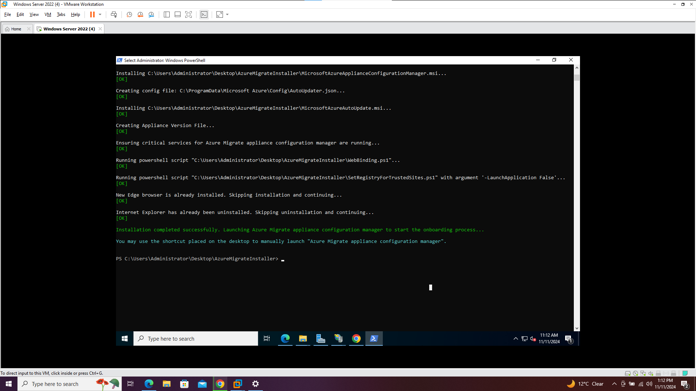

---

## **3. Validation Results**
### **Objective**
To verify the functionality of the migrated VMs in Azure, including the deployment of the "Hello World" application.

### **Validation Steps**
1. **Application Deployment**:
   - Deployed the "Hello World" application on VM1 in Azure.
   - Configured IIS (Internet Information Services) to host the application and mapped it to the VM’s public IP.

2. **Access and Testing**:
   - Accessed the application via `http://<VM1_Public_IP>`.
   - Verified that the application was responsive and displayed the "Hello World" message.

3. **Failover Testing**:
   - Simulated a VM outage to validate the resilience of the migrated application.
   - After failover, the application was still accessible, confirming its reliability.

### **Results**
- The application was fully operational and accessible post-migration.
- No connectivity or performance issues were observed.

### **Supporting Evidence**
- Application running in Azure:

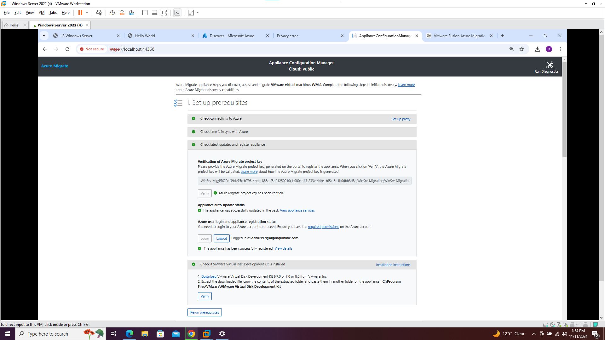

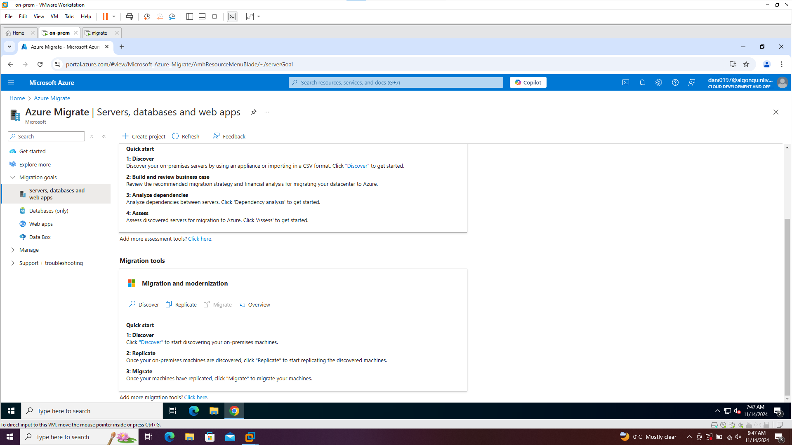

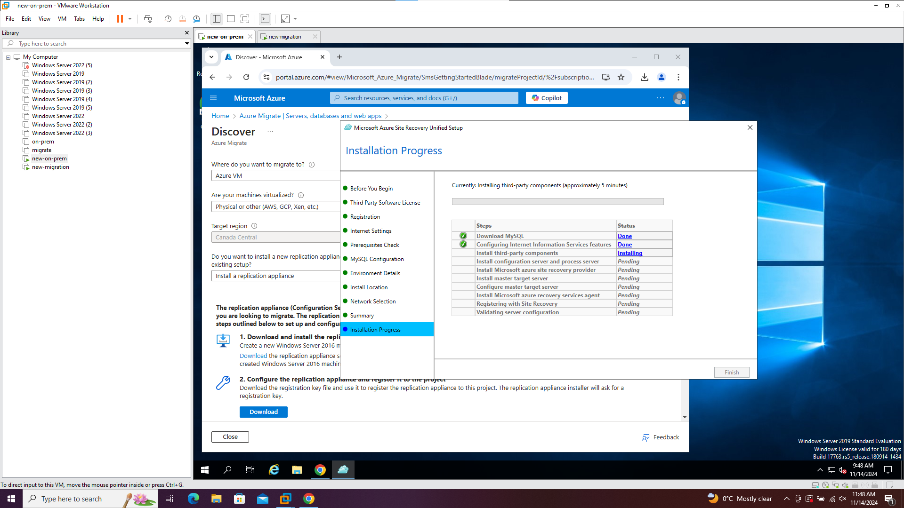

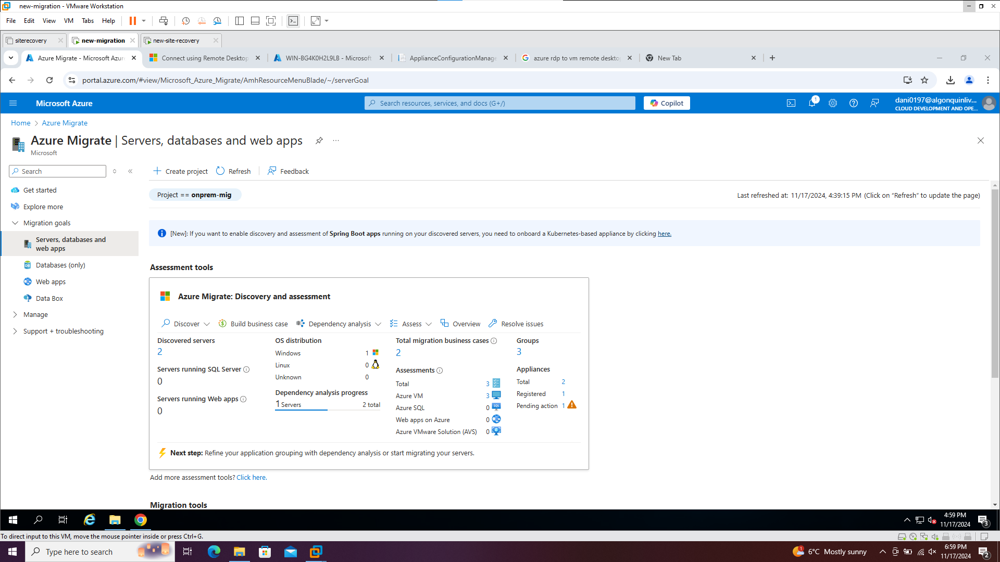

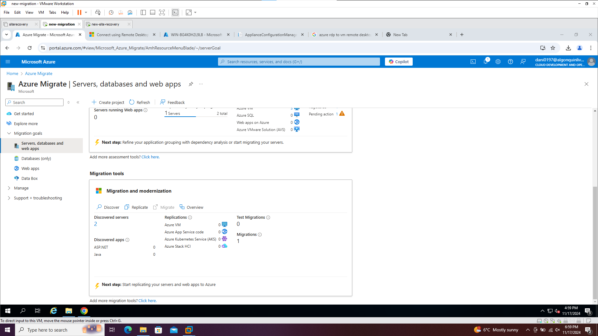

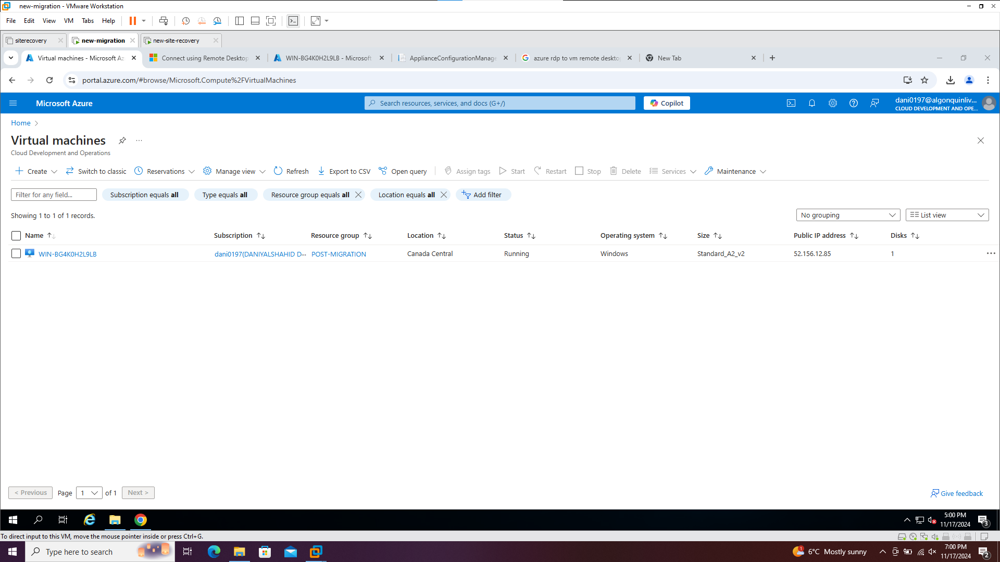

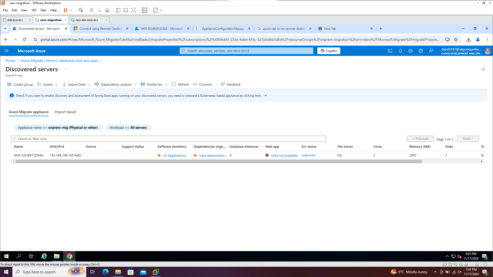

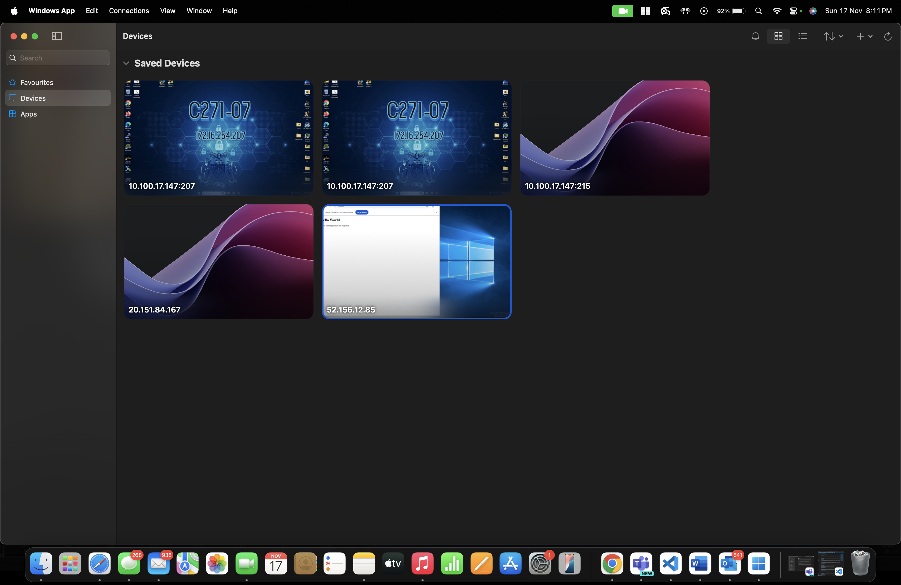

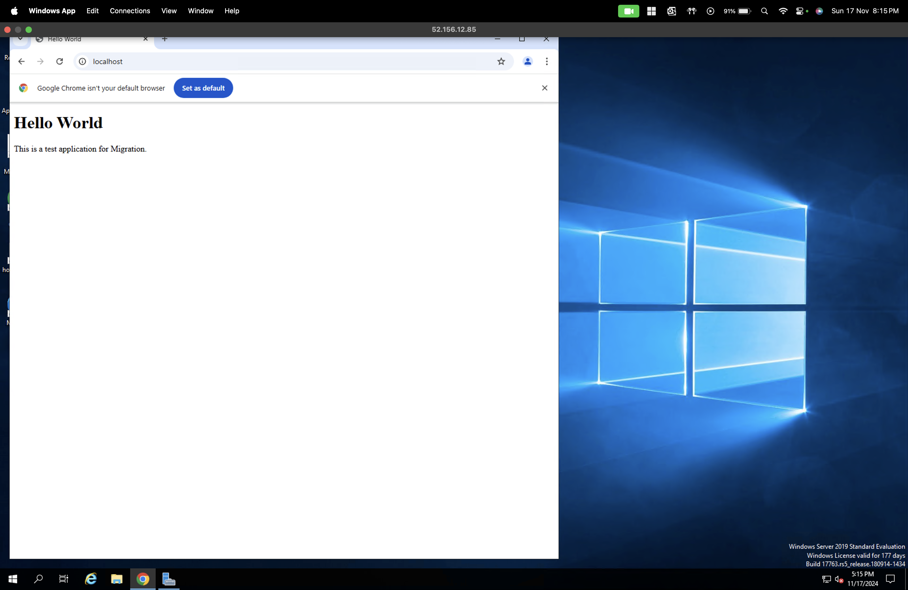

---

## **4. Reflection**
### **Overview**
The migration lab provided valuable insights into the complexities of cloud migration, including preparation, execution, and post-migration validation. It demonstrated the potential of Azure Migrate as a comprehensive tool for transitioning workloads to the cloud.

### **Challenges**
1. **Azure Migrate Appliance Configuration**:
   - Initial setup required troubleshooting SSL errors and manual adjustments for discovery.
2. **Credential Validation Issue**:
   - Addressing the outbound firewall rules to validate credentials emphasized the importance of pre-configuring network policies.
3. **VMware Workstation vs. vSphere**:
   - The lack of vSphere required treating the VMs as physical servers, which added extra steps.

### **Lessons Learned**
- Properly configuring network rules is crucial to ensure connectivity between Azure and on-premises servers.
- How to troubleshoot common issues during the assessment and migration phases.
- The value of pre-migration assessments in identifying compatibility and resource requirements.

### **Future Considerations**
- Explore Azure-native services like Azure Monitor and Auto-Scaling for better performance and cost management.
- Implement disaster recovery strategies to improve the resilience of migrated workloads.

---

## **Failover Testing**
### **Objective**
To ensure the resilience of the migrated "Hello World" application in Azure by conducting a failover test.

### **Steps Taken**
1. **Access the Application Before Failover**:
   - Verified the application functionality by accessing `http://<Public_IP_of_VM1>`.
   - Ensured the "Hello World" application was responsive and operational.

2. **Simulate Failover**:
   - Shut down the Azure VM hosting the application (VM1) from the Azure portal.
   - Monitored the application’s inaccessibility during this period.

3. **Recovery Process**:
   - Restarted the VM using the Azure portal.
   - Verified that the application became operational again after the VM was brought back online.

### **Observations**
- **During Failover**:
  - The application was inaccessible, confirming the simulated downtime.
- **After Failover**:
  - Once the VM was restarted, the application returned to full functionality without any issues.

### **Issues Encountered**
- No significant issues were encountered during the failover simulation.

### **Results**
- The failover test validated the resilience of the migrated application.
- The application successfully resumed operations after the VM restart, demonstrating its reliability in Azure.

### **Supporting Evidence**
- **Application Operational (Before Failover)**:

  

- **Application Inaccessible (During Failover)**:

  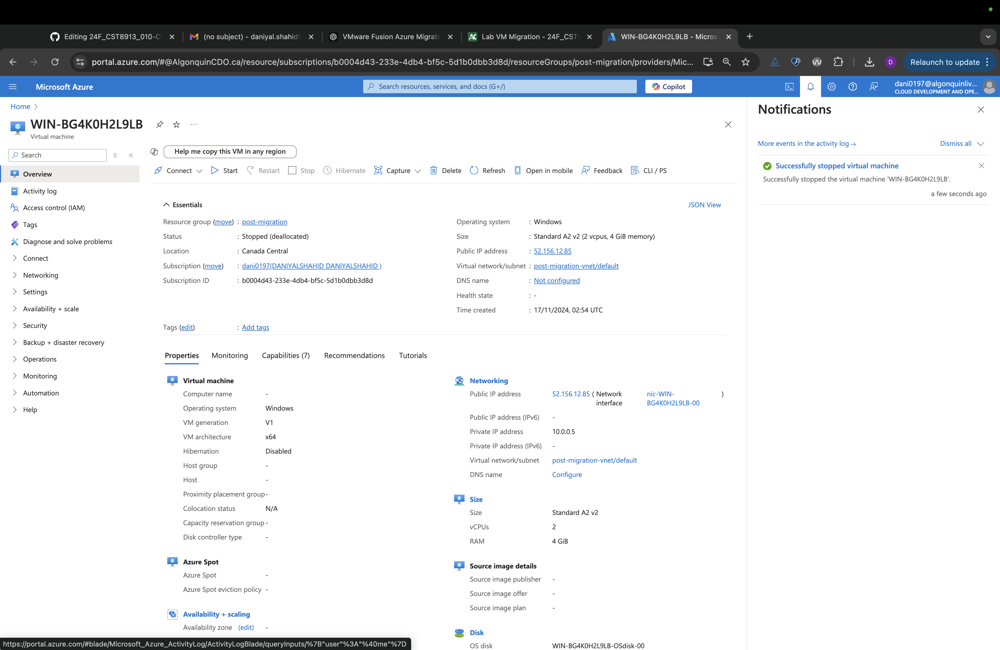

  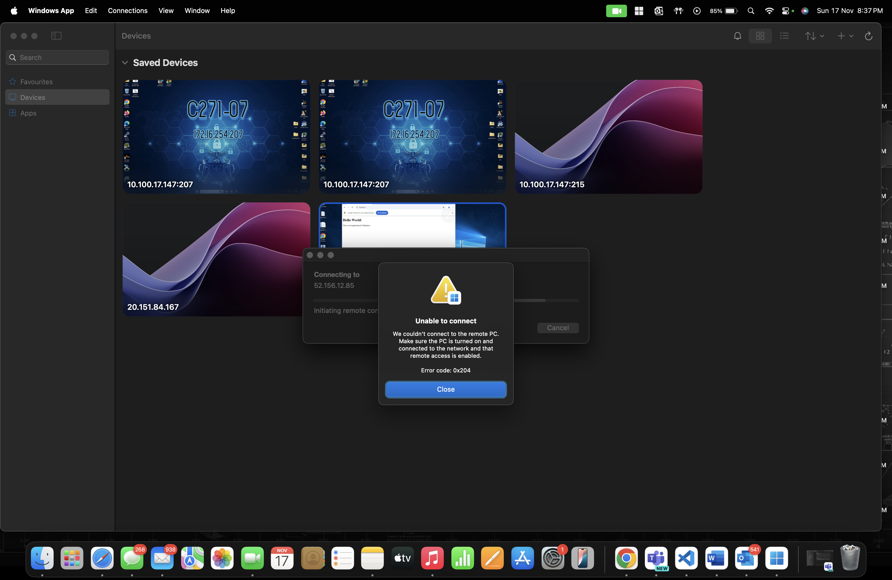

- **Application Recovered (After Failover)**:

  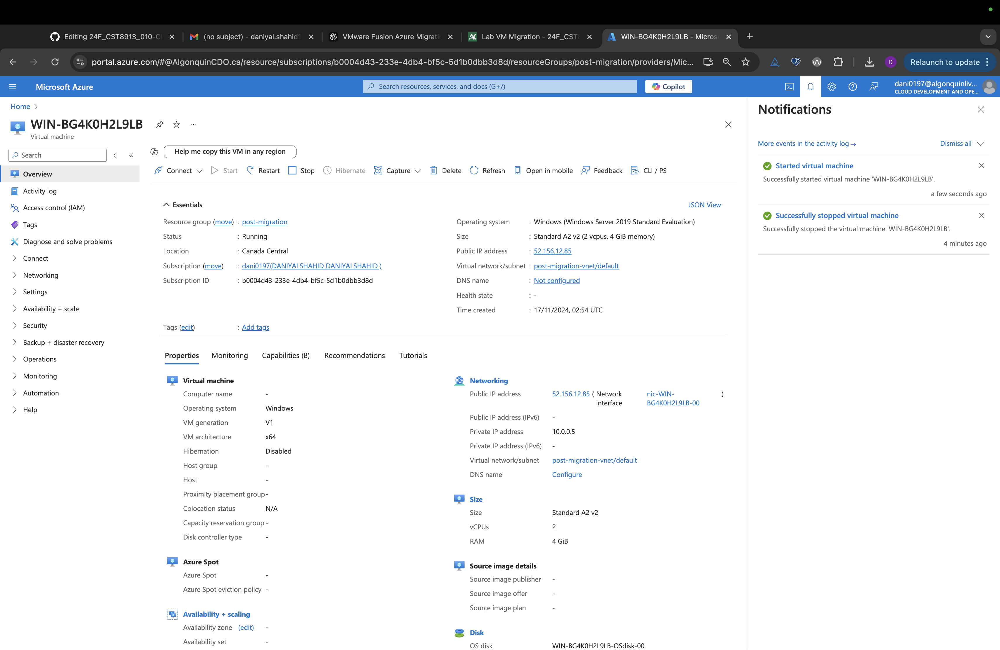

  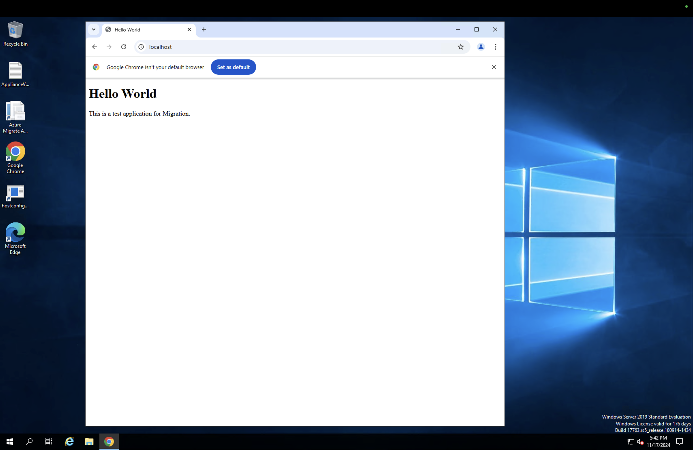

## **Conclusion**
The VMware-to-Azure migration lab successfully demonstrated the entire lifecycle of assessing, migrating, and validating VMs in Azure. Both VMs were transitioned seamlessly, with the "Hello World" application fully functional in the Azure environment. This lab provided hands-on experience in addressing real-world challenges during cloud migration and highlighted best practices for ensuring a successful outcome.

---

