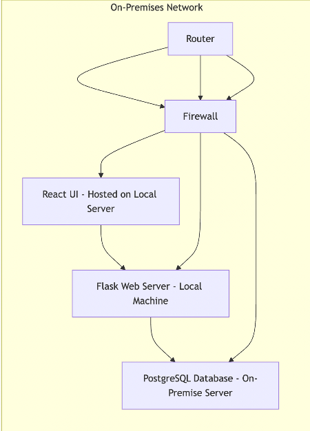
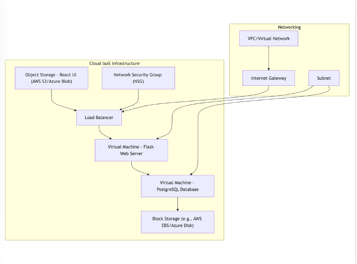
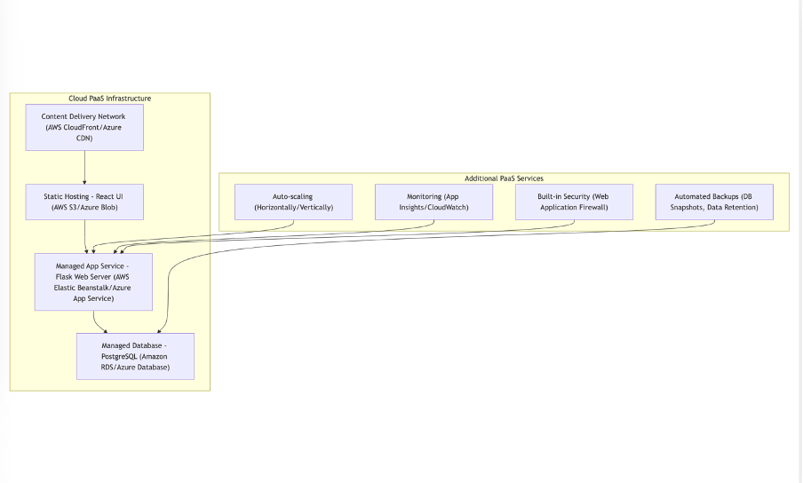

## LAB 2
## CLOUD MIGRATION ARCHITECTURE

This diagram represents the on-premise setup where the web server, database, and frontend UI are hosted on local infrastructure.

## On-Premise Application Diagram

Description

The React UI frontend is hosted on a server within the organization’s network, ensuring everything remains in-house. The Flask web server runs on a separate on-premises machine, while the PostgreSQL database is stored and managed locally. A router and firewall work together to control data flow and secure the entire network.

Security Measures for On-Premises Architecture

To secure the on-premises architecture, implement key measures such as restricted access to the server room, multi-factor authentication, and surveillance cameras. Utilize network security tools like firewalls and intrusion detection systems to monitor activity and prevent unauthorized access. Encrypt sensitive data and regularly update the operating system, web server, and database software with the latest security patches to address vulnerabilities. Implement role-based access control (RBAC) to limit user permissions and minimize risks. Finally, ensure regular data backups and test disaster recovery plans to maintain data integrity and availability.

## Cloud Deployment using IaaS (Infrastructure as a Service)

In this IaaS Model, the infrastructure is set up but the setup needs to be done and upkeep your own operating system, web server, database. 

    Description:

Virtual Machine run the Flask web server and PostgreSQL database, ensuring smooth operation.
The Load Balancer tool evenly distributes traffic across multiple instances of the Flask web server.  The React UI is stored in object storage, such as AWS S3 or Azure Blob, for easy access to static frontend files and for Block Storage, the PostgreSQL database utilizes block storage (like AWS EBS or Azure Disk) to keep data secure and accessible.The NSG, Network Security Group manages and monitors traffic to and from the VMs for enhanced security.

Security Measures for IaaS Architecture

To secure an IaaS architecture, focus on key steps such as regularly updating VMs with the latest security patches, equipping them with firewalls, and using strong passwords. For load balancer security, implement HTTPS to secure all communications. Ensure that data in object storage is encrypted at rest and limit access to authorized users only. When configuring the Network Security Group (NSG), establish clear inbound and outbound rules to control traffic effectively.

## Cloud Deployment using PaaS (Platform as a Service)

In the PaaS model, the cloud provider manages infrastructure including scaling, networking, application runtime. 

    Description:
    
Managed App Service: The Flask web server is hosted on a fully managed platform, such as AWS Elastic Beanstalk or Azure App Service, eliminating the need to manage the underlying infrastructure.
Managed Database: The PostgreSQL database is managed through services like Amazon RDS or Azure Database, handling maintenance and scalability.
Static Hosting: The React UI is delivered from static storage with a content delivery network (CDN) for fast and efficient access.
Auto-scaling: Both the Flask app and database can automatically adjust to varying loads, scaling up or down as needed without manual intervention

Security Measure for PaaS Architecture

To secure your PaaS architecture, utilize the built-in features for authentication and authorization to control access to the application. Ensure that data is encrypted both in transit and at rest, and regularly update settings and patches to mitigate vulnerabilities. Configure HTTPS for the CDN to secure data transfers, and set up monitoring tools to alert you to any suspicious activities. Finally, implement a Web Application Firewall (WAF) to filter and monitor HTTP traffic, providing an additional layer of protection against vulnerabilities. 

