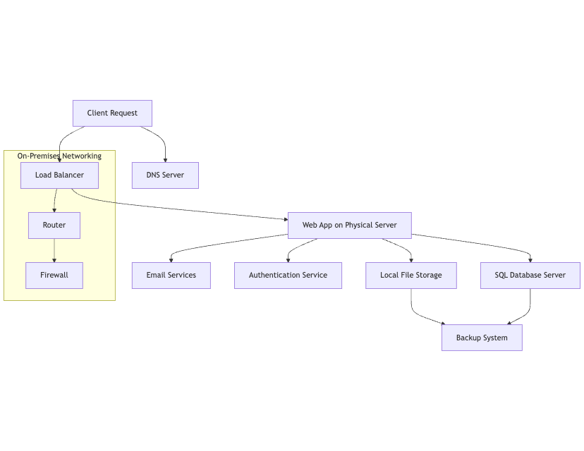

## LAB 3
# Cloud Migration and Cloud Adoption – A Comparative Study of PaaS, IaaS, and SaaS Across Cloud Providers

## Objective
This report is here to help you understand the different offerings of Platform as a Service (PaaS), Infrastructure as a Service (IaaS), and Software as a Service (SaaS) from various cloud providers. We’ll explore how these services can make the transition from a traditional on-premises setup to a cloud environment that’s not just more scalable, but also more reliable and efficient. Whether you’re looking to boost your business’s flexibility or streamline operations, this guide will shed light on the benefits of moving to the cloud.

## Section 1: On-Premises Solution Design

## Current On-Premises Infrastructure
In our mid-sized retail company, we’ve built a traditional on-premises architecture that supports our daily operations. Below is the breakdown of how everything fits together:

# On-Premises Architecture Description

## Client Requests
It all starts with our users! When they want to interact with our system, they send in requests. We’ve got a **Load Balancer (LB)** that takes care of managing all that traffic, ensuring everything runs smoothly without any hiccups.

## Web Application
At the heart of our operations is our **Monolithic Web Application**, which lives on physical servers. This application is our powerhouse—it handles those client requests and works closely with other important components like our database and file storage to keep everything flowing.

## SQL Database Server
Now, let’s talk about our **SQL Database Server**. This is where we store all our crucial business data, like product details, user information, and transaction records. Think of it as our digital filing cabinet—it’s essential for keeping our operations running smoothly.

## Local File Storage
For managing all the files we need—like images and documents—we rely on **Local File Storage**. It has been great so far, but we’re starting to notice some limitations as we grow. We want to ensure we can scale without running into issues.

## Email Services
To keep our clients informed and help our team communicate internally, we use **In-House Email Services**. They keep us connected, but managing them requires time and resources, which can be a bit of a challenge.

## On-Premises Networking
- **Router**: Our trusty Router helps direct traffic within the company’s network. It makes sure that all the data gets to where it needs to go without any fuss.
  
- **Firewall**: Security is a big deal for us, and that’s where our Firewall comes in. It controls the incoming and outgoing traffic, helping us protect our valuable data.
  
- **Backup System**: We all know that accidents happen, so we’ve got a Backup System in place to keep our data safe. It ensures that both our SQL Database Server and Local File Storage are backed up, so we can recover quickly if something goes wrong.

- **DNS Server**: Our DNS Server is like our digital phone book. It translates domain names into IP addresses, making sure that when our users send requests, they reach the right services quickly.

- **Authentication Service**: Lastly, we have our **Authentication Service**. It’s responsible for making sure that only authorized users can access our web application securely. We take security seriously, and this service helps us manage user access effectively.

### Diagram of On-Premises Solution

### Key Components for Migration

To create an effective migration strategy, it’s essential to understand the current architecture. Here are the key components we've identified for migration:

- **Web Application**: Right now, we have a monolithic web application that, while functional, limits our flexibility and responsiveness. Transitioning it to the cloud will open up more options for scaling and improving user experience.

- **Database**: Our SQL database is reliable, but it requires a lot of dedicated resources and hands-on management. Migrating it to a managed cloud service will help streamline operations and reduce the overhead.

- **File Storage**: We’re currently using local file systems for storage, which isn’t ideal for quick scaling. Moving to cloud storage will provide us with more room to grow and make it easier to access files from anywhere.

- **Networking**: The basic networking setup we have in place may not support the demands of a cloud architecture. It’s time to upgrade to cloud-native networking solutions that can enhance security and scalability.

- **Email Services**: Our in-house email solutions are functional but require constant management. Transitioning to cloud-based email services will not only simplify our processes but also improve collaboration and communication.

## Section 2: Cloud Solution Design

### Cloud Architecture

To boost our scalability, reliability, and overall management efficiency, we're planning to move from on-premise to the cloud using a combination  of PaaS, IaaS, and SaaS solutions. By taking this multi-faceted approach, we can ensure that every part of our infrastructure is used to its fullest potential. This way, we’ll not only make the most of our resources but also create a more agile and responsive environment for our business.

### Migration Strategies
The following migration strategies will be employed for each component:

- **Web Application**
Migration Strategy: When it comes to moving our web application, the plan is to refactor it to a Platform as a Service (PaaS) model. We’re considering services like Azure App Services or AWS Elastic Beanstalk for this transition.

    The benefit of using PaaS is that it offers built-in scalability, automatic updates, and less management hassle. After refactoring the application into a more modular structure, we’ll conduct thorough testing to ensure functionality. Once testing is complete, we’ll deploy the application to the selected PaaS platform and set up monitoring tools to track performance and user experience.

- **Database**
Migration Strategy: We can take a “Lift and Shift” approach to move our SQL Database Server to Infrastructure as a Service (IaaS), like Azure Virtual Machines or AWS EC2.

    Managed databases will streamline our operations by handling backups, scaling, and maintenance for us. This means our data will be more reliable and easier to access, allowing our team to work more efficiently,but we should be aware of potential vendor lock-in as well.

- **File Storage**
Migration Strategy: We’ll transition our Local File Storage to a PaaS solution like Azure Blob Storage or AWS S3.

    This shift will give us virtually unlimited storage capacity and make it much simpler to access our files from anywhere.These services provide virtually unlimited storage capacity, high durability, and easy access from anywhere, which addresses our current scalability challenges and makes file management much simpler But, we need to consider data transfer costs and compliance issues.

- **Networking**
Migration Strategy: We’ll implement cloud-native networking solutions, such as Azure VNet or AWS VPC.

   Azure VNet or AWS VPC are great options to consider. These services enhance our security while providing isolated environments and scalable networking capabilities, which are essential as our needs grow.Here, the technicians might need additional training to navigate cloud networking configurations.

- **Email Services**
Migration Strategy: Transitioning to a SaaS solution like Google Workspace or Microsoft 365 makes sense for our email services.

   When it comes to email services, we’ll migrate to SaaS offerings such as Google Workspace or Microsoft 365. Moving to a SaaS model will lift the maintenance burden off our shoulders and provide robust features for collaboration and communication among our team members. There is a need to consider the risks of relying on third-party services in this case. 

- **Identity Management**
Migration Strategy: We can utilize PaaS solutions like Azure Active Directory or AWS IAM for identity management.

   We also need to think about identity management. We’ll utilize cloud-based identity management solutions like Azure Active Directory or AWS IAM. These services centralize user authentication and authorization, making it easier to manage user access and improving overall security.

- **Backup**
Migration Strategy: Implementing cloud-based backup solutions like Azure Backup or AWS Backup will enhance our data protection.

  To ensure our data is protected, we’ll implement managed cloud backup services such as Azure Backup or AWS Backup. These solutions will help us keep our data safe and provide quick recovery options if we ever encounter data loss, giving us peace of mind.

- **Managed DNS**
Migration Strategy: We’ll use cloud-managed DNS services like Azure DNS or AWS Route 53.

   Lastly, for managed DNS, we’ll use cloud-managed DNS services like Azure DNS or AWS Route 53. These services will enhance performance and availability, ensuring that our applications remain accessible to users at all times

## Hybrid Approach
For an easy transition from on-premise to on cloud,  we will start by migrating our Web Application to PaaS while keeping the Database on IaaS initially. This would allow us to ensure the application runs effectively before making further changes. Over time, we can  evaluate if we have to move the database to a fully managed PaaS solution, which will enhance our scalability and reduce management overhead.

This migration plan would help minimize disruptions to our daily operations and enchance flexibility and scalability to the cloud enviornment.

## Suggested Resources
- [Azure Documentation](https://docs.microsoft.com/azure)
- [AWS Documentation](https://docs.aws.amazon.com)
- [Google Cloud Platform Documentation](https://cloud.google.com/docs)

