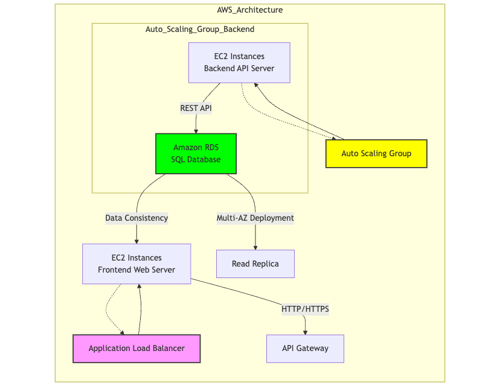

## LAB 5 - CLOUD MIGRATION
## High-Level Design (HLD) document

## Visual Representation of Rehosting  a 3-tier eCommerce application from an on-premises environment to AWS.
The application consists of:

Major AWS services used for this migration and their specific roles 
In the migration to AWS, i utilized a lot of key services:-

1. Amazon EC2 (Elastic Compute Cloud):
Amazon Elastic Compute Cloud (Amazon EC2) is the cloud computing web service hosted on the Amazon EC2 instances. Like we will grade load in these instances with a frontend web server that will execute apache or nginx and render static content. As the backend are EC2 instances, for the API server, we are going to deploy an instance which is going to host the rest API which we have created in either Node.js, Java or.NET.

2. Application Load Balancer (ALB):
Particularly in handling traffic, the role of the ALB is of great importance. Appropriate ec2-s will be fronted by it and made to respond to the pending requests so that no single ec2 instance will be bogged down. This picture framework improves the availability of the system and the performance of the application as a whole. 

3. Amazon RDS (Relational Database Service):
Instead of creating and managing a SQL database in a VM, we shall use Amazon's RDS service. It takes care of everything that concerns database management for us. We will set it up for Multi-AZ deployment which ensures high availability and failover so that our database does not collapse.

4. Auto Scaling:
Auto Scaling is used to address the imbalance in available supply to demand. Once you have virtual machines with APIs and traffic increases, resources become insufficient, as the application is not reusing the previously released VMs.

## Mminimal downtime during the migration process

